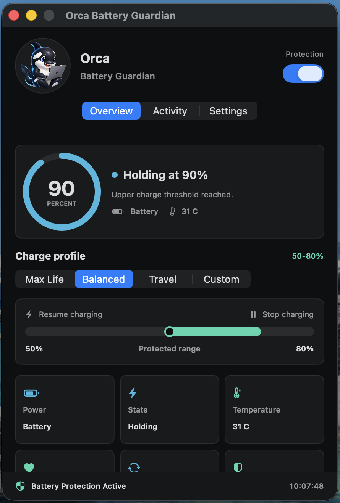
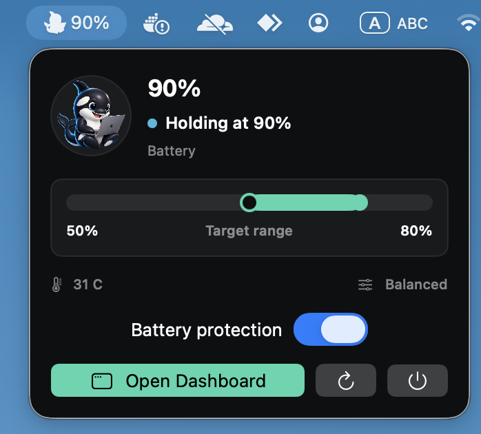
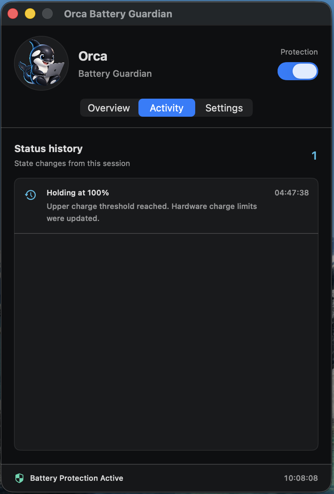
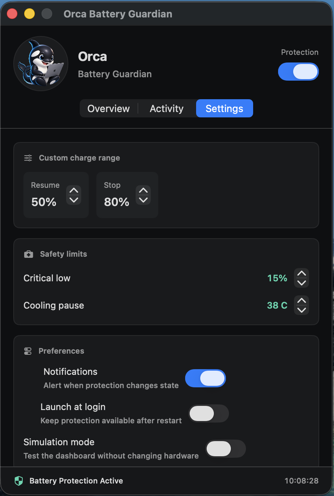

<p align="center">
  
</p>

# Orca Battery Guardian

Orca Battery Guardian เป็นแอปเล็ก ๆ บน Menu Bar สำหรับดูแลการชาร์จ MacBook ผมทำขึ้นมาเพราะไม่อยากปล่อยให้เครื่องเสียบสายและค้างอยู่ที่ 100% ตลอดวัน แต่ก็ไม่อยากได้แอปที่มีหน้าต่างใหญ่หรือเมนูซับซ้อน

ตัวแอปเขียนด้วย Swift และ SwiftUI แสดงเปอร์เซ็นต์แบต แหล่งจ่ายไฟ อุณหภูมิ สุขภาพแบต และจำนวนรอบชาร์จเท่าที่ macOS อ่านได้ พร้อมตั้งช่วงชาร์จที่ต้องการจากหน้าเดียว

**เวอร์ชัน 0.8.0 (Beta) · macOS 13 ขึ้นไป · Universal 2 สำหรับ Apple Silicon และ Intel x86_64**

> การจำกัดการชาร์จจริงบน Apple Silicon ใช้ [batt](https://github.com/charlie0129/batt) ซึ่งต้องติดตั้งแยก ส่วน Mac รุ่น Intel ทำงานใน Monitoring Mode เพราะ `batt` ไม่รองรับ Intel และ Orca ยังไม่มี Intel charge-control backend ที่ตรวจสอบสถานะกลับได้

## ความเข้ากันได้

| ความสามารถ | Apple Silicon | Intel x86_64 |
|---|---:|---:|
| Dashboard, Menu Bar และ notifications | รองรับ | รองรับ |
| Battery %, power source, temperature, health และ cycles | รองรับเท่าที่ IOKit มีข้อมูล | รองรับเท่าที่ IOKit มีข้อมูล |
| Activity history และ export CSV/JSON | รองรับ | รองรับ |
| Battery Benchmark | รองรับ | รองรับ |
| `orca` CLI | รองรับ | รองรับ |
| Simulation Mode | รองรับ | รองรับ |
| ควบคุมช่วงชาร์จผ่าน `batt` | รองรับเมื่อ daemon ยืนยัน capability | ไม่รองรับ |
| Calibration ผ่าน `batt` | รองรับเมื่อ daemon ยืนยัน capability | ไม่รองรับ |

Release build เป็น Universal 2 และมีทั้ง `arm64` กับ `x86_64` ใน app bundle เดียว บน Intel แอปจะไม่พยายามเรียก `batt` หรือเสนอ native charge limit แต่ยังเก็บข้อมูลและใช้เครื่องมือวิเคราะห์ได้ตามปกติ

## หน้าตาแอป

ภาพเหล่านี้มาจากแอปที่รันจริงในเวอร์ชัน 0.2.0 ส่วนเวอร์ชัน 0.3.0 ปรับข้อความสถานะและการตรวจสอบ controller ให้ตรงกับเครื่องมากขึ้น

<table>
  <tr>
    <th>Overview</th>
    <th>Menu Bar</th>
  </tr>
  <tr>
    <td valign="top"><a href="docs/images/overview.png"></a></td>
    <td valign="top"><a href="docs/images/menu-bar.png"></a></td>
  </tr>
  <tr>
    <th>Activity</th>
    <th>Settings</th>
  </tr>
  <tr>
    <td valign="top"><a href="docs/images/activity.png"></a></td>
    <td valign="top"><a href="docs/images/settings.png"></a></td>
  </tr>
</table>

## ทำอะไรได้บ้าง

- ดูสถานะแบตได้จาก Menu Bar โดยไม่ต้องเปิด System Settings
- เลือกช่วงชาร์จสำเร็จรูป หรือกำหนดช่วงเอง
- หยุดเติมไฟเมื่อถึงเพดาน โดยไม่บังคับระบายแบตลงมา
- พักการชาร์จเมื่ออุณหภูมิสูง และยอมให้ชาร์จเมื่อแบตต่ำมาก
- เปิดพร้อมเครื่องและแจ้งเตือนเมื่อสถานะสำคัญเปลี่ยน
- เก็บประวัติการทำงานไว้ดูย้อนหลัง
- มี Simulation Mode สำหรับลองหน้าจอและ state machine โดยไม่ส่งคำสั่งไปที่ฮาร์ดแวร์
- สั่งชาร์จถึง 100% ชั่วคราว 1, 2 หรือ 4 ชั่วโมง แล้วกลับไปใช้โหมดเดิมเอง
- ตรวจ `batt`, daemon, charge limit และความเข้ากันได้จากหน้า Diagnostics
- เก็บ Battery Benchmark แบบรายวัน พร้อมตาราง 7/30/90 วัน กราฟ capacity และ Export CSV
- สลับภาษาไทยและ English ได้ทันทีจากหน้า Settings โดยภาษาไทยใช้ฟอนต์ Sarabun
- ส่งออก Activity เป็น CSV หรือ JSON สำหรับตรวจย้อนหลัง
- ตรวจหาเวอร์ชันใหม่จาก GitHub Releases โดยไม่ดาวน์โหลดหรือรันไฟล์อัตโนมัติ
- ดูและควบคุมขั้นตอน Battery Calibration ผ่าน `batt` โดยอ่านสถานะกลับหลังทุกคำสั่ง
- มี `orca` CLI สำหรับอ่าน status, diagnostics, history และ benchmark จาก Terminal (`orca-battery` ยังใช้เป็น alias ได้)

## โหมดการชาร์จ

| โหมด | เริ่มชาร์จ | หยุดชาร์จ | เหมาะกับ |
| --- | ---: | ---: | --- |
| Maximum Life | 50% | 70% | เครื่องที่เสียบ Adapter อยู่กับโต๊ะเป็นส่วนใหญ่ |
| Balanced | 50% | 80% | ใช้งานทั่วไป และเป็นค่าเริ่มต้นของแอป |
| Travel | 20% | 100% | วันที่ต้องการแบตเต็มก่อนออกไปข้างนอก |
| Custom | กำหนดเอง | กำหนดเอง | คนที่ต้องการตั้งช่วงให้เข้ากับการใช้งานของตัวเอง |

## ภาษา

เลือก `ไทย` หรือ `English` ได้จากหน้า Settings แอปจะจำภาษาที่เลือกไว้ หากยังไม่เคยเลือก Orca จะใช้ภาษาไทยเมื่อภาษาหลักของ macOS เป็นภาษาไทย และใช้ English ในกรณีอื่น

ข้อความบน Dashboard, Menu Bar, สถานะแบตเตอรี่, Diagnostics และการแจ้งเตือนรองรับทั้งสองภาษา ภาษาไทยใช้ [Sarabun](https://fonts.google.com/specimen/Sarabun) ซึ่งรวมมากับแอปภายใต้ SIL Open Font License ส่วนชื่อคำสั่งและหน่วยทางเทคนิคบางรายการ เช่น `batt`, CSV และ mAh จะคงรูปเดิมเพื่อให้ตรวจสอบได้ง่าย

ในโหมด Custom ค่าเริ่มและหยุดต้องห่างกันอย่างน้อย 5% ส่วน Travel จะปิด charge limit แล้วปล่อยให้ macOS จัดการการชาร์จตามปกติ ไม่ได้บังคับให้แบตวิ่งระหว่าง 20-100%

### ตั้งไว้ 80% แต่ทำไมแบตยังอยู่ 100%

เพราะ Orca ไม่ได้สั่งให้เครื่องใช้แบตทั้งที่ยังเสียบสายอยู่ ถ้าเปิดใช้ตอนแบตเต็ม เครื่องอาจรับไฟจาก Adapter โดยที่เปอร์เซ็นต์ยังค้างอยู่แถวเดิมได้

ถ้าต้องการเห็นผลทันที ให้ถอดสายและใช้งานจนแบตลดลงมาใกล้ช่วงที่ตั้งไว้ แล้วค่อยเสียบกลับ แอปไม่มีโหมดบังคับ discharge เพราะไม่ต้องการเพิ่มรอบแบตโดยไม่จำเป็น

### ชาร์จเต็มชั่วคราว

กด `Charge to 100%` แล้วเลือกระยะเวลา 1, 2 หรือ 4 ชั่วโมง Orca จะจำโหมดเดิมไว้และนำกลับมาใช้เมื่อแบตเต็ม, หมดเวลา, ยกเลิก หรือ Quit แอป เวลาที่เลือกไว้ยังอยู่หลังปิดแล้วเปิดแอปใหม่หากยังไม่หมดอายุ

ฟังก์ชันนี้ใช้ได้เมื่อเปิด Battery Protection และใช้ controller ของ Orca หากกำลังใช้ Charge Limit ของ macOS ให้ใช้คำสั่ง `Charge to Full Now` จากเมนูแบตเตอรี่ของระบบแทน

## ติดตั้งสำหรับใช้งานบนเครื่องตัวเอง

ต้องมี Xcode หรือ Command Line Tools ที่รองรับ Swift 6 ก่อน จากนั้นรัน:

```sh
git clone https://github.com/kridsadar357/OrcaBattGuard.git
cd OrcaBattGuard
swift test
./Scripts/package-app.sh
./Scripts/install-app.sh
```

`package-app.sh` จะสร้าง Release build ไว้ที่ `build/OrcaBatteryGuardian.app` และเซ็นแบบ ad-hoc สำหรับเครื่องที่ build ส่วน `install-app.sh` จะติดตั้งไปที่ `/Applications` แล้วเปิดแอปให้ หากมีเวอร์ชันเก่าอยู่ สคริปต์จะรอให้แอปปิดและสำรองไฟล์เดิมก่อนแทนที่

ระหว่างพัฒนาสามารถรันตรงจาก Swift Package ได้:

```sh
swift run OrcaBatteryGuardian
```

การรันคำสั่งนี้ยังควบคุมแบตจริงได้หากพบ `batt` ถ้าต้องการลองโดยไม่แตะค่าของเครื่อง ให้เปิด Simulation Mode ก่อน

## เปิดใช้การควบคุมการชาร์จจริง

ส่วนนี้ใช้กับ Apple Silicon เท่านั้น โปรเจกต์ไม่ได้เขียนค่า SMC โดยตรงและไม่มี privileged helper ของตัวเอง การควบคุม charge limit จึงอาศัย `batt` ที่ติดตั้งแยกต่างหาก

```sh
brew install batt
sudo brew services start batt
batt status --json
```

เมื่อติดตั้งเรียบร้อย ให้เปิด Orca แล้วเลือกโหมดที่ต้องการ แอปจะอ่านค่ากลับจาก daemon ก่อนแสดงคำว่า `Charge limits verified` ถ้า daemon หยุดทำงาน ตอบช้า หรือค่าที่อ่านกลับมาไม่ตรง หน้าจอจะแสดงว่า controller ยังไม่ผ่านการยืนยันและจะลองใหม่ในรอบถัดไป

ตรวจสถานะด้วยตัวเองได้จาก:

```sh
batt status --json
pmset -g batt
```

คำว่า `Verified` หมายถึงช่วงชาร์จใน `batt` ตรงกับค่าที่เลือก ไม่ได้แปลว่ากระแสชาร์จหยุดในวินาทีนั้นทันที ควรดู Power, State และ charge rate ประกอบด้วย

### กลับไปใช้การชาร์จแบบปกติ

ปิด Battery Protection ในแอป หรือ Quit Orca แล้วรัน:

```sh
batt disable
batt status --json
```

การ Quit แอปอย่างเดียวไม่ได้หยุด daemon และไม่ได้ล้างค่าที่ `batt` เก็บไว้ ส่วน Simulation Mode จะไม่เปลี่ยนค่าเดิมของฮาร์ดแวร์

## แอปทำงานอย่างไร

Orca รับเหตุการณ์จาก macOS ทันทีเมื่อแหล่งจ่ายไฟหรือสถานะแบตเปลี่ยน และตรวจซ้ำทุก 30 วินาทีเผื่อเหตุการณ์ตกหล่น รวมถึงตรวจใหม่หลังเครื่องตื่นจาก sleep ถ้าช่วงชาร์จไม่ตรงกับโหมดที่เลือก แอปจะส่งคำสั่งแก้แล้วอ่านค่ากลับอีกครั้ง จะแสดงว่า verified ก็ต่อเมื่อค่าตรงกันจริง

คำสั่ง `batt` และ `pmset` ทำงานเบื้องหลัง จึงไม่ทำให้หน้าต่างแอปค้างระหว่างรอ daemon แต่ละคำสั่งมีเวลาให้ทำงานไม่เกิน 3 วินาที งานเก่าจะถูกยกเลิกเมื่อสลับโหมด และไม่อนุญาตให้มีคำสั่งควบคุมหลายชุดทำงานซ้อนกัน

แอปไม่ได้บังคับ discharge ระหว่างช่วงล่างกับช่วงบน ถ้าเครื่องใช้ไฟจาก Adapter และไม่ได้ชาร์จ สถานะจะเป็น `Holding` จนกว่าจะต้องเริ่มชาร์จอีกครั้ง

### อุณหภูมิและแบตต่ำ

ค่าเริ่มต้นของ Cooling Pause คือ 38 C และ Critical Low คือ 15% เมื่อเครื่องร้อน Orca จะลดเพดานชาร์จชั่วคราวแล้วคืนค่าเดิมเมื่ออุณหภูมิลดลง หากแบตต่ำกว่า Critical Low ระบบจะให้ความสำคัญกับการชาร์จก่อน

นี่เป็นเพียงเงื่อนไขเสริมในระดับแอป ไม่ใช่ระบบป้องกันความร้อน และไม่แทนที่การป้องกันที่ macOS หรือฮาร์ดแวร์มีอยู่แล้ว

## ประวัติการทำงาน

Activity เก็บเหตุการณ์สำคัญ เช่น การเปลี่ยนโหมด, controller ใช้งานไม่ได้, controller กลับมาทำงาน และการคืนค่า charge limit ไฟล์อยู่ที่:

```text
~/Library/Application Support/OrcaBatteryGuardian/history.json
```

แอปเก็บไม่เกิน 500 รายการหรือ 512 KiB โดยลบรายการเก่าที่สุดก่อน ไฟล์นี้อยู่ในเครื่องเท่านั้นและไม่ได้ถูกส่งออกไปที่ไหน หากอ่านหรือเขียนไฟล์ไม่ได้ จะมีคำเตือนในหน้า Activity แทนการเขียนทับไฟล์เดิมเงียบ ๆ

กดเมนูมุมขวาบนของหน้า Activity เพื่อส่งออกเป็น CSV หรือ JSON ได้ ไฟล์ส่งออกมีเวลา หัวข้อ และรายละเอียดของแต่ละเหตุการณ์ โดยแอปจะไม่ส่งไฟล์ออกจากเครื่องเอง

## Calibration

หน้า Settings แสดงสถานะ Calibration ที่อ่านจาก `batt` และรองรับ Start, Pause, Resume และ Cancel เฉพาะเมื่อ daemon รายงานว่าใช้คำสั่งนั้นได้ การเริ่ม Calibration ต้องยืนยันอีกครั้ง เพราะกระบวนการจะคายประจุ ชาร์จเต็ม และอาจใช้เวลาหลายชั่วโมง

ระหว่าง Calibration ตัว state machine ของ Orca จะไม่เขียนทับค่าที่ `batt` กำลังจัดการ ควรเสียบ Adapter เปิดฝาเครื่อง และป้องกันไม่ให้เครื่อง sleep จนกว่ากระบวนการจะเสร็จ ไม่ควรทำ Calibration บ่อยหากไม่มีเหตุผล เพราะเป็นการเพิ่มรอบใช้งานแบตเตอรี่โดยตั้งใจ

## Updates

Orca ตรวจ GitHub Releases ได้ไม่เกินวันละครั้งเมื่อเปิดการตรวจอัตโนมัติ หรือกด `Check Now` ใน Settings การตรวจนี้ส่งเพียง HTTP request ปกติไปยัง GitHub และไม่มี telemetry ของโปรเจกต์ หากมีรุ่นใหม่ แอปจะเปิดหน้า Release ให้ผู้ใช้ตรวจและดาวน์โหลดเอง

## Command Line Interface (CLI)

ตัวแอปมี CLI แบบ read-only ชื่อ `orca` คำสั่งนี้ใช้ดูสถานะ ตรวจ diagnostics และ export ข้อมูลได้จาก Terminal โดยไม่ต้องเปิด Dashboard ส่วนชื่อเดิม `orca-battery` ยังเป็น alias เพื่อให้สคริปต์ที่มีอยู่ใช้งานต่อได้

### ติดตั้ง CLI

หลังติดตั้ง Orca ไว้ใน `/Applications` แล้ว ให้รันจากโฟลเดอร์โปรเจกต์:

```sh
./Scripts/install-cli.sh
```

สคริปต์จะคัดลอก CLI จากตัวแอปไปที่ `~/.local/bin/orca` และสร้าง alias `orca-battery` โดยไม่ต้องใช้สิทธิ์ผู้ดูแล ตรวจผลหลังติดตั้งได้ด้วย:

```sh
command -v orca
orca version
orca diagnostics
```

หาก `~/.local/bin` ไม่อยู่ใน `PATH` ให้เพิ่มบรรทัดนี้ใน `~/.zshrc` แล้วเปิด Terminal ใหม่:

```sh
export PATH="$HOME/.local/bin:$PATH"
```

ไฟล์ที่ติดตั้งเป็นสำเนาของ CLI ใน app bundle หลังอัปเดต Orca ควรรัน `./Scripts/install-cli.sh` อีกครั้งเพื่อให้ CLI เป็นเวอร์ชันเดียวกับแอป

หากต้องการติดตั้งให้ผู้ใช้ทุกบัญชีในเครื่องเรียกได้ ให้ใช้โหมด system ซึ่งจะถามรหัสผ่าน `sudo`:

```sh
./Scripts/install-cli.sh --system
```

โหมดนี้ติดตั้ง `orca` และ alias `orca-battery` ที่ `/usr/local/bin`

### ติดตั้งผ่าน Homebrew

โปรเจกต์มี Formula ชื่อ `orca-battery` ซึ่งติดตั้งคำสั่ง `orca` และ alias เดิมจาก release tag ที่ตรวจสอบด้วย SHA-256:

```sh
brew tap kridsadar357/orca-batt-guard https://github.com/kridsadar357/OrcaBattGuard.git
brew install kridsadar357/orca-batt-guard/orca-battery
```

วิธีนี้ build CLI จาก source และต้องมี Xcode 16 หรือใหม่กว่า การติดตั้งผ่าน Formula เป็น CLI เท่านั้น ไม่ได้ติดตั้งแอป GUI หากต้องการทดลองโค้ดล่าสุดบน branch `main` ให้เพิ่ม `--HEAD` ในคำสั่ง `brew install`

อัปเดตหรือถอน CLI ที่ติดตั้งผ่าน Homebrew ได้ตามปกติ:

```sh
brew update
brew upgrade orca-battery
brew uninstall orca-battery
```

### การใช้งาน

```sh
# สถานะแบตแบบอ่านง่ายหรือ JSON
orca status
orca status --json

# ตรวจ battery API, ตำแหน่งแอป, batt daemon และ charge limits
orca diagnostics

# ดูสถานะ Calibration เท่านั้น คำสั่งนี้ไม่เริ่ม Calibration
orca calibration

# ส่งออก Activity history
orca history --format csv --output activity.csv
orca history --format json --output activity.json

# ส่งออกตาราง Battery Benchmark
orca benchmark --output benchmark.csv

# ตรวจ GitHub Releases
orca update

# แสดงเวอร์ชันและรายการคำสั่ง
orca version
orca help
```

พาธใน `--output` เป็นได้ทั้ง relative path และ absolute path หากไม่ใส่ `--output` คำสั่ง export จะแสดงข้อมูลทาง stdout จึงสามารถ pipe ไปยังโปรแกรมอื่นได้ เช่น:

```sh
orca status --json | jq
orca history --format csv > activity.csv
```

CLI คืน exit code ที่ไม่ใช่ศูนย์เมื่อคำสั่งหรือข้อมูลไม่พร้อม จึงใช้ใน shell script และระบบ monitoring ได้ แต่ CLI ไม่เปลี่ยน charge limit, ไม่เริ่ม Calibration และไม่สั่ง force discharge คำสั่งที่เปลี่ยนฮาร์ดแวร์ยังอยู่ใน GUI ซึ่งมี confirmation และตรวจสถานะกลับ

ถอน CLI แบบ user-local โดยไม่กระทบตัวแอปหรือข้อมูล Benchmark/Activity ได้ด้วย:

```sh
rm ~/.local/bin/orca ~/.local/bin/orca-battery
```

ถ้าติดตั้งด้วย `--system` ให้ถอนด้วย `sudo rm /usr/local/bin/orca /usr/local/bin/orca-battery`

## Battery Benchmark

หน้า Benchmark เริ่มเก็บ baseline จากข้อมูลแบตครั้งแรกที่แอปอ่านได้ แล้วสรุปเป็นรายวันเพื่อเทียบ Full Charge Capacity, สุขภาพแบตโดยประมาณ, Cycle Count, อุณหภูมิ, เวลาที่อยู่เหนือ 80% และเวลาที่ Battery Protection ทำงาน เลือกดูช่วง 7, 30 หรือ 90 วันได้ และ Export ตารางรายวันเป็น CSV จากเมนูมุมขวาบน

ข้อมูลอยู่ในเครื่องที่:

```text
~/Library/Application Support/OrcaBatteryGuardian/benchmark.json
```

ไฟล์เก็บเฉพาะผลรวมรายวันสูงสุด 400 วัน ไม่เก็บรายการดิบทุก 30 วินาที และไม่นับช่วงยาวที่แอปปิดหรือเครื่องหลับเป็นเวลาป้องกัน สามารถเลือก `Reset Baseline` เพื่อเริ่มวัดใหม่ได้ ส่วน Simulation Mode จะไม่ถูกนำมาปนกับข้อมูลจริง

ค่า capacity และ health มาจาก battery controller และอาจขยับขึ้นลงระหว่างวัน จึงควรดูแนวโน้มหลายสัปดาห์แทนการสรุปจากจุดเดียว Benchmark ช่วยให้เห็นการเปลี่ยนแปลง แต่ไม่ได้พิสูจน์ว่า Orca เป็นสาเหตุของการเปลี่ยนแปลงนั้นโดยตรง

## สำหรับนักพัฒนา

โค้ดแยกส่วนอ่านแบต, state machine, charge controller, process runner และ history store ออกจากกัน เพื่อให้ทดสอบ logic ได้โดยไม่ต้องส่งคำสั่งไปที่แบตจริง และยังสามารถเปลี่ยน backend เป็น privileged helper ของโปรเจกต์เองได้ในอนาคต

```text
Sources/OrcaBatteryGuardian/
├── Models/
├── Resources/
├── Services/
└── UI/
```

รันเทสต์ได้ทั้ง Debug และ Release:

```sh
swift test
swift test -c release
```

ตอนนี้มี 92 tests ครอบคลุม state machine, timeout, cancellation, daemon failure, ค่าที่ถูกเปลี่ยนจากภายนอก, Temporary Full Charge, Cooling Hysteresis, Diagnostics, architecture gating, power-source events, Simulation Mode, การบันทึกและ export ประวัติ, Battery Benchmark, Calibration, update checker และระบบภาษา/ฟอนต์ เทสต์ของ controller ใช้ข้อมูลจำลอง ไม่หยุด daemon และไม่เปลี่ยน charge limit ของเครื่อง

ผลตรวจรุ่นปัจจุบันอยู่ใน [verification report 0.8.0](docs/verification-0.8.0.md) และยังเปิดดู [รายงานรุ่น 0.7.0](docs/verification-0.7.0.md) ได้

## ข้อจำกัดตอนนี้

- ยังไม่ได้ทดสอบกับ MacBook และ macOS ครบทุกรุ่น
- Intel slice ผ่าน cross-build และทดสอบผ่าน Rosetta แล้ว แต่ยังควรทดสอบบน Intel MacBook จริง
- ยังไม่ได้ทดสอบเปิดต่อเนื่องหลายวัน, restart และ sleep/wake หลายรอบ
- ยังใช้ `batt` เป็น backend ภายนอก ไม่ได้รวมตัวควบคุมมากับแอป
- ระบบอัปเดตทำหน้าที่ตรวจเวอร์ชันและเปิดหน้า Release เท่านั้น ยังไม่ดาวน์โหลดหรือติดตั้งรุ่นใหม่ให้อัตโนมัติ
- Calibration ต้องพึ่งความสามารถของ `batt` และเป็นงานที่เพิ่มรอบชาร์จ จึงควรใช้เฉพาะเวลาที่ค่าประเมินแบตผิดปกติ ไม่ใช่งานประจำ
- Cooling Pause เป็น policy ของแอป ไม่ใช่ระบบรับรองความปลอดภัยด้านอุณหภูมิ

Orca ยังเป็น Beta ผมแนะนำให้เปิดดูสถานะเป็นระยะ โดยเฉพาะช่วงแรกที่ลองกับ Mac รุ่นใหม่ แอปช่วยจัดช่วงชาร์จได้ แต่ไม่ได้ซ่อมแบตที่เสื่อมแล้วและไม่สามารถรับประกันอายุแบตได้

## Contributors

- [Kridsadar (@kridsadar357)](https://github.com/kridsadar357)
